# TLX

### Table of Contents

- [Live](#Live)
- [Description](#Description)
- [Screen Shot](#Screen-Shot)
- [Technologies](#Technologies)
- [Author](#Author)

---

## Live

[Live Site] - https://tlxs.herokuapp.com/

---

## Description

This app was created to give tenants and property managers a single place to exchange.
Specifically, tenants and property managers can converse through messages, as well as manage billing.

---

## Screen Shots

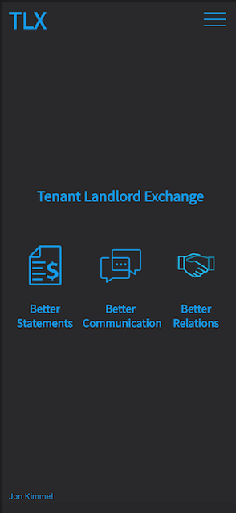
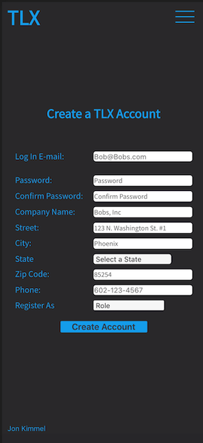
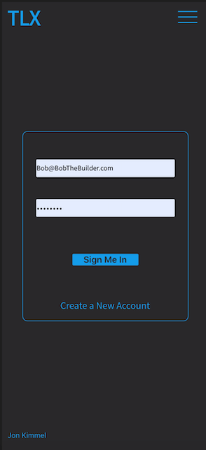
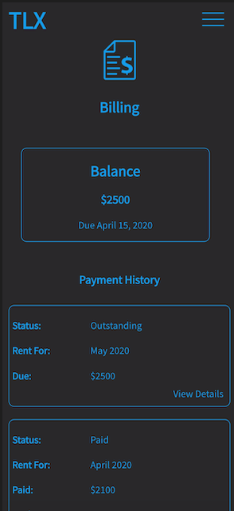
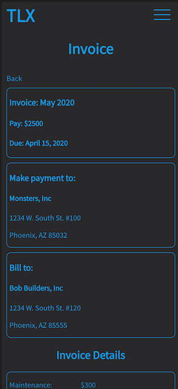
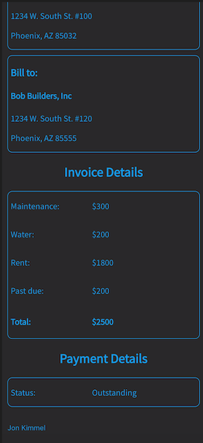
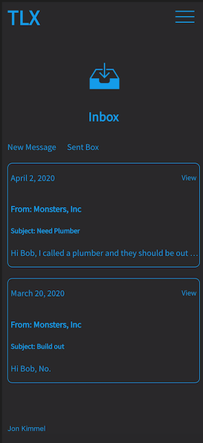
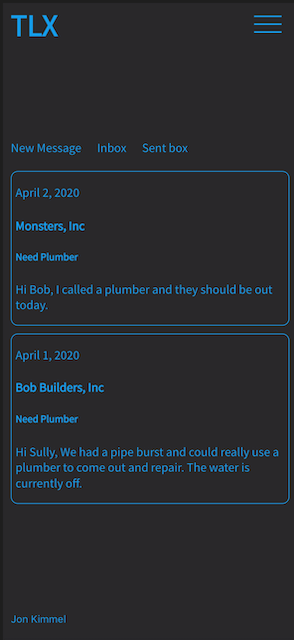
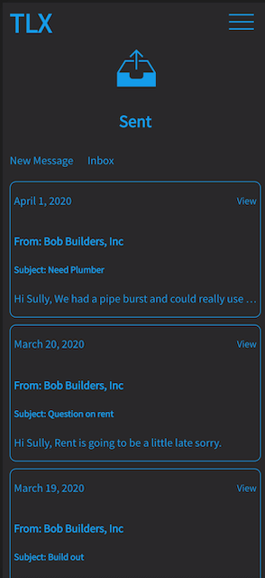
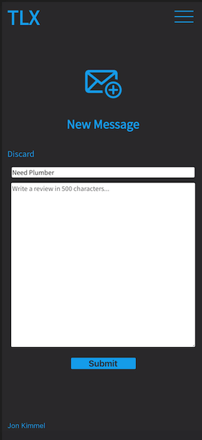
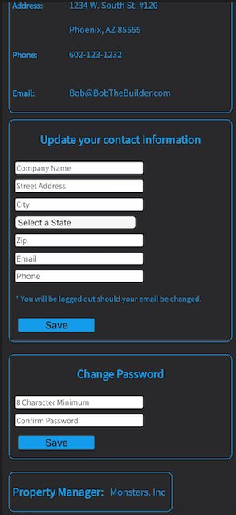
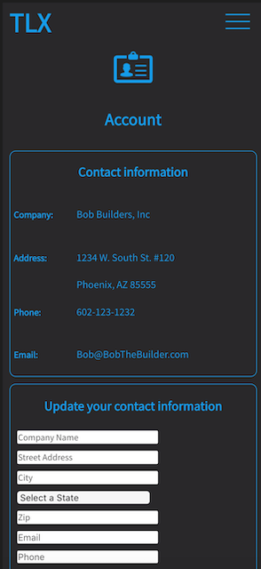

---

## Technologies

#### Front-End

- React.js
- RESTful api
- Context
- React-Router

#### Back-End

- Node.js
- Express
- KNEX
- PostgreSQL

#### Testing

- Jest
- Mocha
- Chai
- Chai-http

## Author

- Jon Kimmel - Front and Back-End
- Website - www.JonathonKimmel.com

[Back To Top](#TLX)
